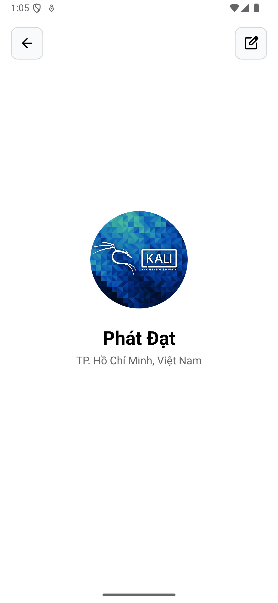

# BÀI TẬP TUẦN 1 – PHAN PHÁT ĐẠT

## Câu 1: Mong muốn và định hướng sau môn học

Sau khi hoàn thành môn học, mình mong muốn có thể:
- Tự tin xây dựng ứng dụng Android.
- Kết hợp lập trình di động với trí tuệ nhân tạo (AI), đặc biệt trong thị giác máy tính.
- Mục tiêu cá nhân: xây dựng ứng dụng phát hiện tế bào ung thư từ ảnh vi phẫu phục vụ nghiên cứu khoa học.
- Về lâu dài: phát triển ứng dụng di động tích hợp AI – xu hướng tiềm năng trong công nghệ và y tế.

---

## Câu 2: Lập trình di động trong 10 năm tới?

Lập trình di động sẽ tiếp tục phát triển mạnh mẽ vì:
- Điện thoại thông minh đã trở thành thiết bị không thể thiếu.
- Công nghệ AI, AR/VR, IoT đang tích hợp sâu vào hệ sinh thái mobile.
- Lập trình di động không chỉ "viết app", mà còn xây dựng các giải pháp thông minh đa ngành.

---

## Câu 3: Ứng dụng UI mẫu

Ứng dụng hiển thị:
- Avatar người dùng
- Họ tên: Phát Đạt
- Địa chỉ: TP.Hồ Chí Minh, Việt Nam

Viết bằng Kotlin trong Android Studio  
Mã nguồn: `UserID/`

Hình ảnh giao diện mẫu:

---

Bài làm của **Phan Phát Đạt** – đã hoàn tất và được đẩy lên GitHub theo yêu cầu.
