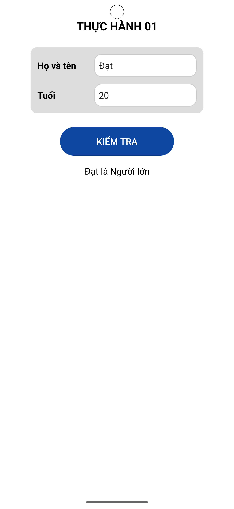

# Ứng dụng kiểm tra độ tuổi người dùng (Kotlin)

Ứng dụng được viết bằng Kotlin trên Android Studio. Người dùng nhập họ tên và tuổi, sau đó ứng dụng sẽ hiển thị thông tin và phân loại độ tuổi tương ứng như: Em bé, Trẻ em, Người lớn, hoặc Người già.

---

## Công nghệ sử dụng

- Ngôn ngữ: Kotlin  
- IDE: Android Studio  
- UI: XML Layout  
- Android SDK: API 21+

---

## Cách chạy ứng dụng

1. Mở Android Studio.
2. Chọn `File > Open` và trỏ đến thư mục dự án (ví dụ: `BTVN/`).
3. Đợi quá trình sync Gradle hoàn tất.
4. Kết nối thiết bị ảo (AVD) hoặc điện thoại thật.
5. Nhấn nút **Run** (hoặc `Shift + F10`) để chạy ứng dụng.

---

## Quy tắc phân loại độ tuổi

- Em bé: Tuổi ≤ 2  
- Trẻ em: 2 < Tuổi ≤ 6  
- Người lớn: 6 < Tuổi ≤ 65  
- Người già: Tuổi > 65  

---

## Giao diện demo

- Người dùng nhập **Họ và tên**, **Tuổi**.
- Nhấn nút **Kiểm tra**, ứng dụng hiển thị kết quả như:  
- `Nguyễn Văn A - 70 tuổi → Người già`

---
