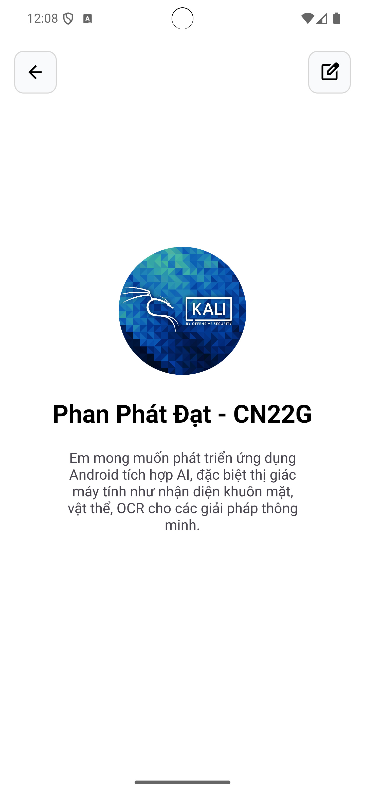

# Ứng dụng Hello World hiển thị thông tin cá nhân (Kotlin)

Ứng dụng này được viết bằng Kotlin trên Android Studio, hiển thị màn hình với ảnh đại diện, tên sinh viên và một câu hỏi định hướng như mẫu thiết kế.

---

## Công nghệ sử dụng

- Ngôn ngữ: Kotlin  
- IDE: Android Studio  
- UI: XML layout  
- Android SDK: API 21+

---

## Cách chạy ứng dụng

1. Mở Android Studio.
2. Chọn `File > Open` và trỏ đến thư mục dự án (ví dụ: `BaiTH1/`).
3. Đợi Android Studio sync Gradle (mất vài phút nếu lần đầu).
4. Kết nối thiết bị ảo (AVD) hoặc điện thoại thật.
5. Bấm nút **Run** (hoặc `Shift + F10`) để chạy ứng dụng.

---

## Giao diện demo

- Ảnh avatar tròn ở giữa màn hình
- Họ tên và mã sinh viên: `Nguyen Van A – CNXXX`
- Câu hỏi định hướng:  
  _“Mong muốn và định hướng của Bạn là gì sau khi học xong môn học là gì?”_

---

