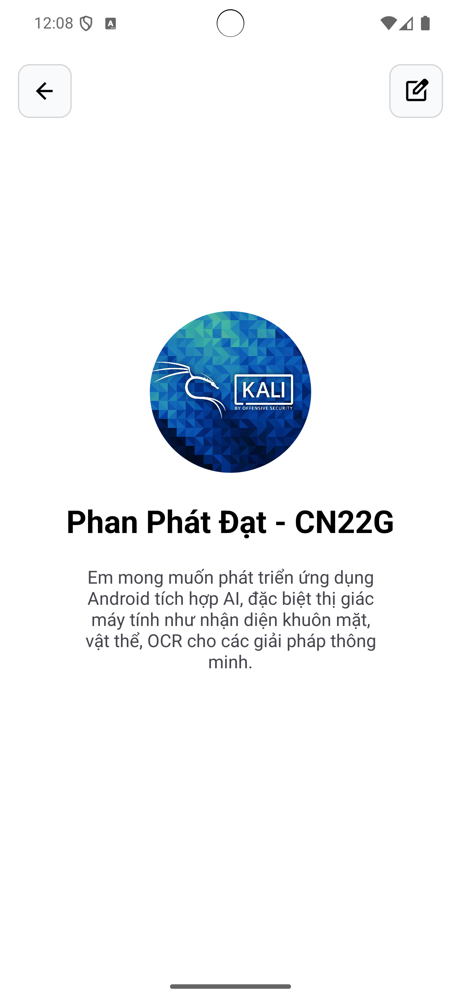
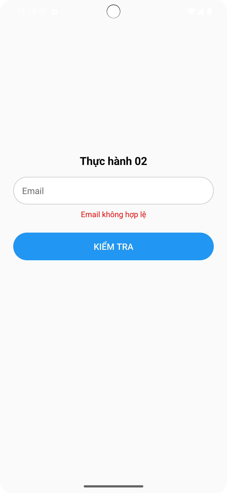
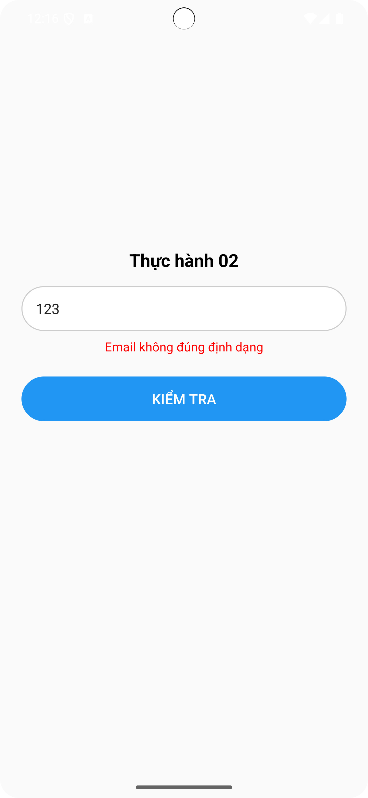
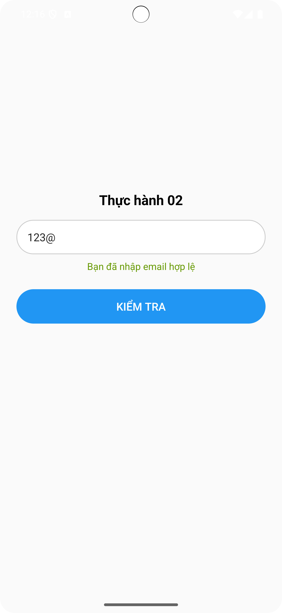

# Bài tập Thực hành Android Kotlin – UTH - Phan Phát Đạt

Đây là bộ bài tập thực hành cơ bản được thực hiện bằng Kotlin trên Android Studio, bao gồm các thao tác nhập liệu, hiển thị thông tin và xử lý logic đơn giản theo yêu cầu.

---

## 📌 Danh sách bài tập

### 🔹 Thực hành 1: Hello World (20 phút)

- Mục tiêu: Cài đặt Android Studio, tạo project đầu tiên, hiển thị ảnh đại diện, tên sinh viên và một câu hỏi định hướng.
- Màn hình gồm:
  - Ảnh avatar tròn
  - Họ tên sinh viên + mã lớp
  - Câu hỏi: “Mong muốn và định hướng của bạn là gì sau khi học xong môn học?”

📷 Giao diện mẫu:  

---

### 🔹 Thực hành 2: Kiểm tra định dạng Email (30 phút)

- Mục tiêu: Tạo form nhập email, kiểm tra tính hợp lệ của email.
- Logic xử lý:
  - Nếu email là `null` hoặc rỗng → thông báo: **Email không hợp lệ**
  - Nếu email không chứa `@` → thông báo: **Email không đúng định dạng**
  - Nếu hợp lệ → thông báo: **Bạn đã nhập email hợp lệ**

📷 Giao diện mẫu:
- Email rỗng:   
- Sai định dạng:   
- Hợp lệ: 

---

### 🔹 Tuần 02 – Kiểm tra độ tuổi người dùng

- Mục tiêu: Nhập họ tên và tuổi, sau đó phân loại người dùng theo độ tuổi.
- Quy tắc phân loại:
  - **Em bé**: Tuổi ≤ 2
  - **Trẻ em**: 2 < Tuổi ≤ 6
  - **Người lớn**: 6 < Tuổi ≤ 65
  - **Người già**: Tuổi > 65

📷 Giao diện mẫu:  

---

## 🛠 Công nghệ sử dụng

- Ngôn ngữ: Kotlin  
- IDE: Android Studio  
- Giao diện: XML Layout  
- Android SDK: API 21+

---

## 🚀 Cách chạy các ứng dụng

1. Mở Android Studio.
2. Chọn `File > Open`, trỏ tới từng thư mục dự án: `BaiTH1/`, `BaiTH2/`, `BTVN/`.
3. Đợi Android Studio sync Gradle hoàn tất.
4. Kết nối thiết bị ảo hoặc thiết bị thật.
5. Nhấn **Run** hoặc `Shift + F10` để chạy ứng dụng.

---

